# Weather Me简介
me天气是一款由Flutter打造的，可以同时在Android、iOS上运行，并且界面能够保持一致的天气预报应用。通过me天气应用可以方便地查看国内主要城市地区的天气预报信息。应用内主要功能有城市地区的搜索和管理，实时天气信息、天气灾害预警、未来两小时降水预报、未来72小时天气预报，未来30日天气预报、空气质量预报和生活指数预报。另外应用还有中英文语言切换，浅色深色主题切换和天气信息的单位切换功能。

手机定位使用的是[高德定位的Flutter插件](https://lbs.amap.com/api/flutter/guide/positioning-flutter-plug-in/location-flutter-info)，天气数据来自[和风天气api](https://dev.qweather.com)，需要说明的是，由于涉及到开发者的账户安全，代码中高德定位的Flutter插件和和风天气api的key均未上传，所以clone后是无法直接打包运行的，需要自行前往申请对应的key，而且应用中使用了和风天气api需付费的商业版接口，望知晓。
```dart
// 和风天气key
// 以下两个可以需要自行申请
late var _key = kDebugMode
    ? devKey // 开发版
    : apiKey; // 商业版

// 高德定位key
/// 初始化
void init() {
  AMapFlutterLocation.setApiKey(androidKey, iosKey); // android、iOS的key需要自行申请
}
```

下面就说明应用中一些有特色的点来说明一下。应用中的自定义Widget并没有借助第三方插件来实现，而是开发者自己实现的，从`pubspec.yaml`文件中也可以看出：
```yaml
dependencies:
  flutter:
    sdk: flutter
  flutter_localizations:
    sdk: flutter

  cupertino_icons: ^1.0.4
  dio: ^4.0.4
  shared_preferences: ^2.0.13
  json_annotation: ^4.4.0
  intl: ^0.17.0
  amap_flutter_location: ^3.0.0
  permission_handler: ^9.2.0
  flutter_svg: ^1.0.3
  flutter_riverpod: ^2.0.0-dev.3
  package_info_plus: ^1.4.0
  google_fonts: ^2.3.1

dev_dependencies:
  flutter_test:
    sdk: flutter

  flutter_lints: ^1.0.0
  build_runner: ^2.1.7
  json_serializable: ^6.1.4
```

# 状态管理
项目中使用[flutter_riverpod](https://pub.dev/packages/flutter_riverpod)进行状态管理，它和[provider](https://pub.dev/packages/provider)师出同门，Provider用自己的话来说是“`InheritedWidget`的封装，但更简单且复用能力更强” ，而Riverpod就是在Provider的基础上更进一步。在于不依赖`BuildContext`（其实就是换了另外一种依赖形态），因为不依赖BuildContext，也就是说Riverpod中的Provider可以随意写成全局性的，并且不依赖于BuildContext来编写业务逻辑，而且Riverpod中的Provider之间可以存在一条依赖链，从而更容易实现响应式布局。

例如在应用中所有的天气数据的展示都依赖于定位到的地区信息，所以所有的天气信息请求都可以依赖于地区信息，意思就是只关注地区信息的变化，一旦发生变化则请求网络并刷新界面，这样在地区信息变化时的逻辑就很简单了。
```dart
/// 获取高德定位后的adCode、ID、经纬度、文本的provider
final adCodeProvider = StateProvider.autoDispose<String>((ref) {
  return '';
});

/// 监听 adCode 的区域查询
final lookupProvider = FutureProvider.autoDispose<LookupArea>((ref) async {
  final cancelToken = CancelToken();
  ref.onDispose(() => cancelToken.cancel());
  ref.keepAlive();
  String adcode = ref.watch<String>(adCodeProvider);
  if (adcode.isEmpty) return LookupArea.empty();
  List<LookupArea> list = await geoDio.lookupLocation(adcode: adcode, cancelToken: cancelToken);
  return list.isEmpty ? LookupArea.empty() : list.first;
});

AsyncValue<WeatherModel> asyncValue = ref.watch(weatherProvider);
WeatherModel model = asyncValue.when(
  data: (model) {
    // ...
    return model;
  },
  error: (err, stack) => WeatherModel.empty(),
  loading: () => WeatherModel.empty(),
);
if (model.city.id == '--') return const LoadingPage();
```
上面的代码中`lookupProvider`依赖于`adCodeProvider`，这样在`adcode`发现变化时lookupProvider会再次请求位置信息，而`weatherProvider`间接依赖于lookupProvider，这样界面就可以监听lookupProvider的变化带来的数据变化，从而及时刷新页面了。这就是使用Riverpod进行响应式布局的一般流程。

# 路由管理
相比于Navigator 1.0中的命令式api，项目中使用了声明式的Navagator 2.0 api，这样看上去更加Flutter。Navagator 2.0中能做到对路由信息的统一管理。
```dart
/// 路由跳转的便捷方法
void push(BuildContext context, {required String name}) => AppRouterDelegate.of(context).push(name);
```
更详细的代码请查看文件`navigator_manager.dart`。


# 应用首页


## 布局动画
应用首页是一个自定义实现的可伸缩吸附式滑动布局，并且具有下拉刷新的功能。布局包含动态的天气背景、Appbar、右上侧的Icon组、浮于卡片上方的banner、刷新动画以及主体的可滚动部分，布局结构是使用`Stack+Positioned`实现的，其中的进入退出动画是根据滑动部分（使用`CustomScrollVieww`实现）的滑动`offset`计算出来的偏移系数，最后通过修改`Positioned`的位置来实现的：
```dart
_scrollController.addListener(() {
  // 判断吸顶时是fling还是手指的滑动
  _isOverTop = _scrollController.offset > _scrollDistance;
  if (_isTop && !_isOverTop && !_isTouch) _scrollToTop();

   // 更新透明度系数
  bool upBuonds = _scrollController.offset > _scrollDistance;
  bool downBounds = _scrollController.offset < 0;
  if (upBuonds || downBounds) return;
  double opacity = _scrollController.offset / _scrollDistance;
  _opacityNotifier.value = opacity;
  // 控制天气背景的播放
  if (opacity == 1) {
    togglePlay(ref, false);
  } else if (opacity == 0) {
    togglePlay(ref, true);
  }
  });
```

## 局部刷新
得到滑动系数后后就可以通知界面进行刷新了，这里是使用的是`ValueListenableBuilder`，`ValueListenableBuilder`是比`setState`进行界面刷新更好的选择，`ValueListenableBuilder`可以对刷新的范围进行控制，从而减少渲染压力，而`setState`是直接将当前`State`刷新，这通常会导致当前路由的整棵Widget树重绘，浪费性能。所以`ValueListenableBuilder`是在路由中进行局部刷新的更好的选择。
```dart
ValueListenableBuilder builder = ValueListenableBuilder<double>(
  valueListenable: _opacityNotifier,
  builder: (context, opacity, child) {
    return Stack(
      alignment: Alignment.topCenter,
      children: [
        Positioned(child: widget.background),
        Positioned.fill(child: _buildMaskLayer(opacity)),
        Positioned(
          child: ValueListenableBuilder<List<double>>(
            valueListenable: _heightsNotifier,
            builder: (context, list, child) => _getScrollView(opacity, list),
          ),
        ),
        _getAppBar(opacity),
        _geticonList(opacity),
        ValueListenableBuilder<double>(
          valueListenable: _refreshNotifier,
          builder: (context, value, child) => RefreshBanner(distance: value),
        ),
      ],
    );
  },
);
```

## 吸附效果
而`CustomScrollVieww`的吸附效果也是基于滑动`offset`计算出来，当向上向下滑动超过一定距离时就自行滑动到顶/底部。
```dart
/// 滚动到顶部
void _scrollToTop() {
  _scrollController.animateTo(
    _scrollDistance,
    duration: const Duration(milliseconds: 200),
    curve: Curves.decelerate,
  );
  _isTop = true;
}

/// 滚动到底部
void _scrollToBottom() {
  _scrollController.animateTo(
    0.0,
    duration: const Duration(milliseconds: 200),
    curve: Curves.decelerate,
  );
  _isTop = false;
}
```

## 刷新动画
刷新动画使用`CustomPainter`自绘实现的，动画过程通过`AnimationController`进行驱动。
```dart
Widget builder = AnimatedBuilder(
  animation: _controller,
  builder: (BuildContext context, Widget? child) {
    return CustomPaint(
      painter: RefreshPainter(
        process: _controller.value,
        isRefresh: ref.read(isRefreshProvider.notifier).state,
      ),
    );
  },
);
```
Flutter的`Canvas`和`Paint`和android中的使用方法大同小异。首先使用`Path`绘制第一个方块，然后再判断是否应该放大，最后再按此逻辑绘制后面的方块，根据`AnimationController`的值改变应该放大的方块，已形成动画的效果。
```dart
for (int i = 0; i < 3; i++) {
  canvas.save();
  // 对需要缩放的色块进行缩放
  if (i == _scaleIndex && isRefresh) {
    canvas.translate(
      left + cellWidthSize * 2 / 2,
      (cellHeightSize * 3) / 2,
    );
    canvas.scale(1.3);
    canvas.translate(
      -(left + cellWidthSize * 2 / 2),
      -(cellHeightSize * 3) / 2,
    );
  }
  // 绘制色块
  _paint.color = _listColor[i];
  path.reset();
  path
    ..moveTo(left, cellHeightSize * 3)
    ..lineTo(left + cellWidthSize, 0)
    ..lineTo(left + cellWidthSize * 2, 0)
    ..lineTo(left + cellWidthSize, cellHeightSize * 3)
    ..close();
  canvas.drawPath(path, _paint);
  left += cellWidthSize * 2;
  canvas.restore();
}
```
# 动态天气背景
me天气可以根据实时的天气类型展示对应的动态天气背景，可以展示的天气类型有晴、阴、云类型、雷电天气、雨、雪、雾、霾、浮/沙尘天气。

|白天晴|夜晚晴|阴|多云|
|:----:|:----:|:----:|:----:|
|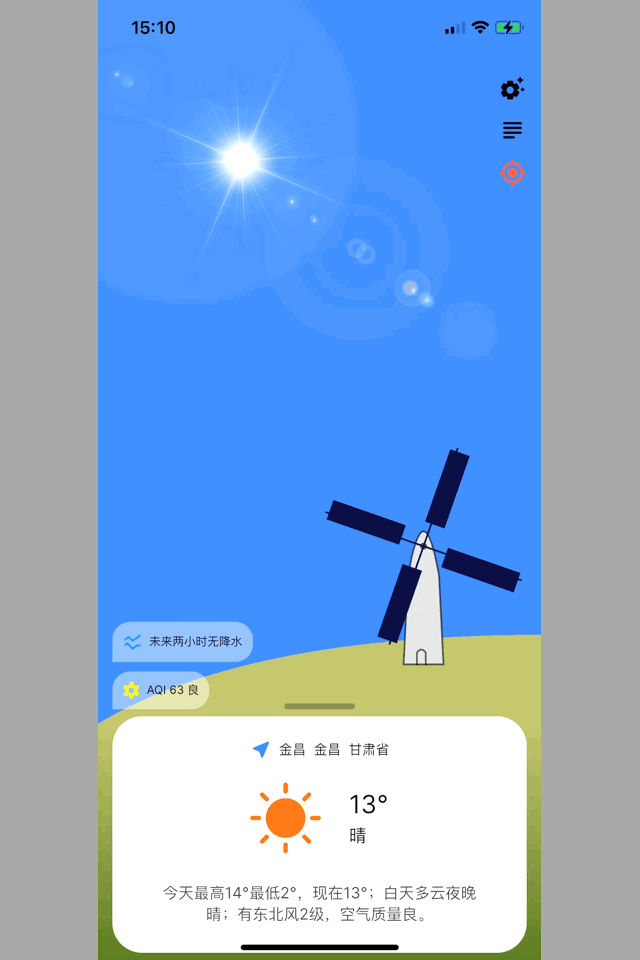|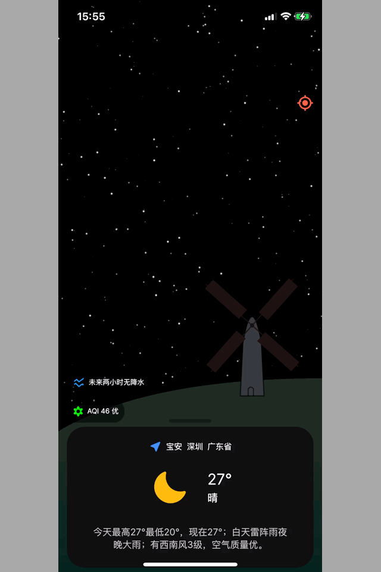|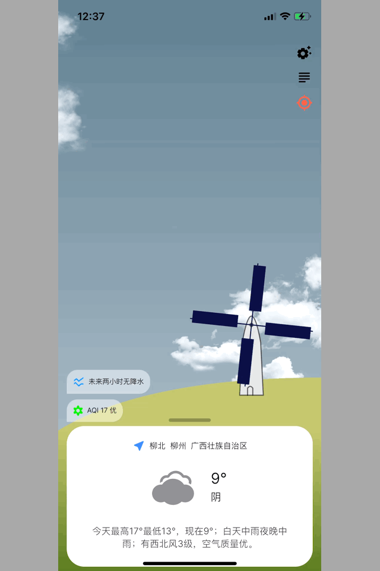||

|强雷阵雨|雨|雪|雾|
|:----:|:----:|:----:|:----:|
|||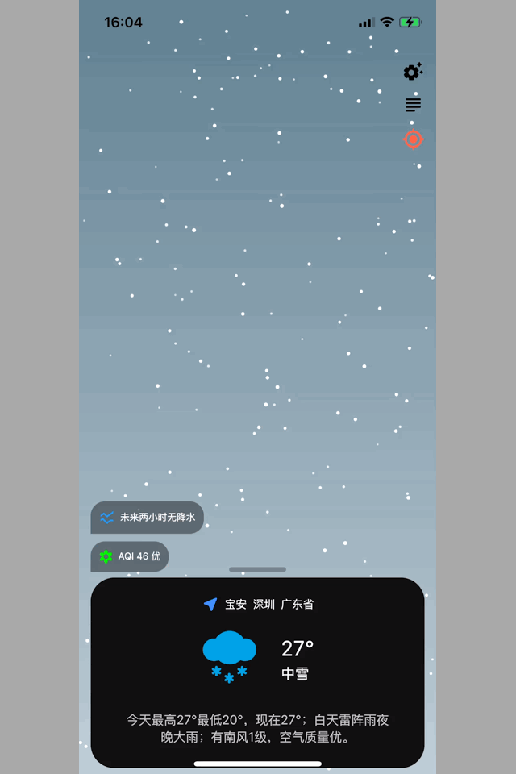|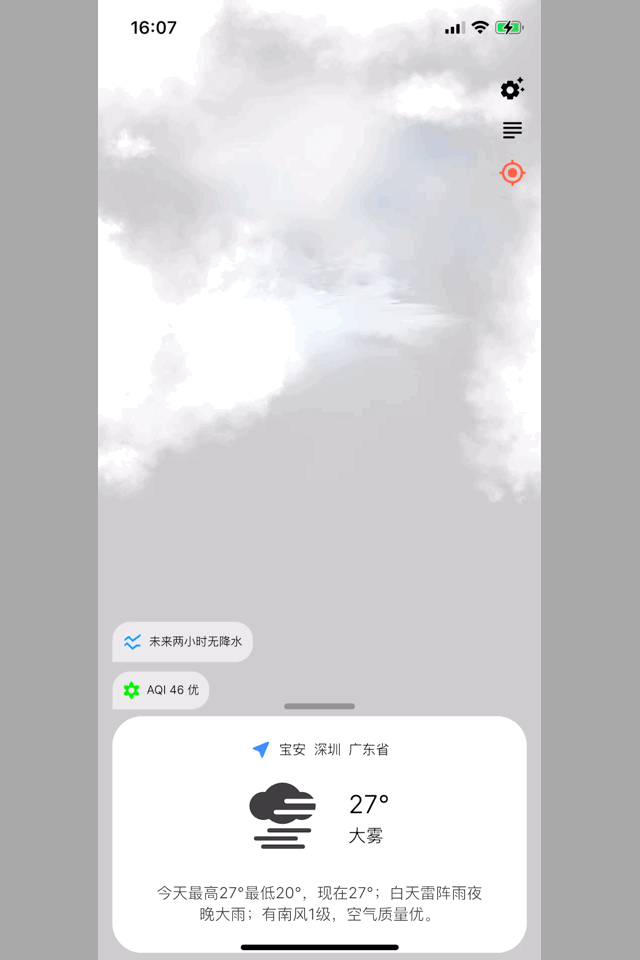|

|霾|浮/沙尘|
|:----:|:----:|
|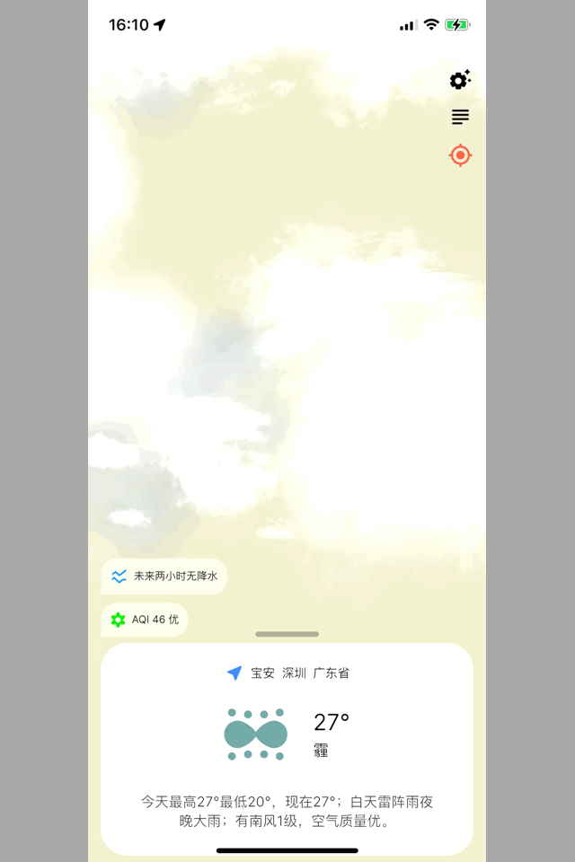||

## 构成
动态天气背景也是首页布局的组成部分，动态天气背景又可以分为：
- 最下层的一层渐变色，也已用来表明天气的色调和白天还是夜晚；
- 一层天气的类型层，比如云朵，太阳雨等；
- 一层风车层。
天气的类型层和风车层都是可动画的。

## 动画的实现
动画的实现有两种方式，一种是使用`Stack+Positioned`实现的，动画过程通过`AnimationController`进行驱动，连续的改变`Positioned`的位置信息从而达到动画的效果。例如云朵移动的动画效果，分解开来就是多张云朵的图片使用`Positioned`定位，并为每一个图片生成对应的控制类，最后动态的修改控制类里的位置数据，就可以到达动画的效果。
```dart
/// 构建可动画的云朵Widget
Widget _buildCloud(CloudConfig config, Image image) {
  AnimatedBuilder builder = AnimatedBuilder(
    child: Opacity(
      opacity: widget.isDay ? .8 : .5,
      child: image,
    ),
    animation: _controller,
    builder: (context, child) {
      config.move();
      Positioned positioned = Positioned(
        top: config.top,
        left: config.left,
        child: child!,
      );
      return positioned;
    },
  );
  return builder;
}

/// 云朵的配置数据
class CloudConfig {
  final CloudType type;

  CloudConfig({
    required this.type,
  });

  /// 水平方向每一格的宽度，用于计算云朵左侧的起始位置
  final double _cellWidth = logicWidth / 4;

  /// 云朵的左边起始位置
  late final List<double> leftPositions = [-_cellWidth, -_cellWidth * 3, _cellWidth * 2, _cellWidth];
  late double left = leftPositions[Random().nextInt(4)];

  /// 垂直方向每一格的高度，用于计算云朵顶部的位置
  late final double _cellHeight = (type == CloudType.partlyCloudy ? 1 / 3 : 0) * logicHeight / 4;

  /// 云朵的顶端位置
  late final List<double> topPositions = [-_cellHeight, _cellHeight, _cellHeight * 2, _cellHeight * 4];
  late double top = topPositions[Random().nextInt(4)];

  /// 云朵的速度
  final List<double> velocitys = [.1.px, .15.px, .2.px, .25.px];
  late double velocity = velocitys[Random().nextInt(4)];

  void move() {
    left -= velocity;
    if (left < -logicWidth) {
      left = logicWidth;
      top = topPositions[Random().nextInt(4)];
      velocity = velocitys[Random().nextInt(4)];
    }
  }
}
```
其中`AnimatedBuilder`是显示动画的万能Widget，在现有的可动画Widget中没能满足需求时，就可以使用它来实现，不过是需要自己管理`AnimationController`、`Curve`和`Tween`的。

另种方式就是自由度更大的`CustomPainter`自绘实现的，例如雨、雪、夜晚晴都是`CustomPainter`实现的。以雨为例，同样需要一个雨滴的动画控制类，动画过程也是通过`AnimationController`进行驱动的。
```dart
Widget rain = AnimatedBuilder(
  animation: _controller,
  builder: (context, child) {
    for (var raindRop in _raindRops) {
      raindRop.fall();
    }
    return CustomPaint(
      painter: RainPainter(
        isDay: widget.isDay,
        type: widget.type,
        raindRops: _raindRops,
      ),
    );
  },
);
```
这种方式和第一种方式的不同就是图像的展示方式，第一种是直接使用`Positioned`定位图片，第二种则是使用`CustomPainter`自绘实现。

## 动画的播放/停止
动态天气的播放是在主页的卡片吸底且可见的情况下才开始的，其余的任何情况都会暂停播放。

首先是利用`Riverpod`再全局状态管理的便捷性，发布一个用于控制动画是否播放的变量，动画就可以依赖于该变量进行动画状态的改变。
```dart
/// 用于控制天气背景的播放和暂停
mixin WeatherController {
  void togglePlay(WidgetRef ref, bool isStop) {
    WidgetsBinding.instance?.addPostFrameCallback((timeStamp) {
      ref.read(isPlayProvider.notifier).toggle(isStop);
    });
  }

  void listenPlay(WidgetRef ref, AnimationController controller) {
    ref.listen<bool>(isPlayProvider, (older, newer) {
      newer ? controller.repeat() : controller.stop();
    });
  }
}

/// 天气背景动画播放开关的 provider
final isPlayProvider = StateNotifierProvider<IsPalyNotifier, bool>((ref) {
  return IsPalyNotifier();
});

class IsPalyNotifier extends StateNotifier<bool> {
  IsPalyNotifier() : super(false);

  void toggle(bool isStop) => state = isStop;
}
```
而动态天气的动画效果是靠`AnimationController`进行驱动的，所以一旦首页不可见，系统自会停止发布页面刷新的`vsync`信号，动画自然会停止。

# 地区的搜索和列表管理
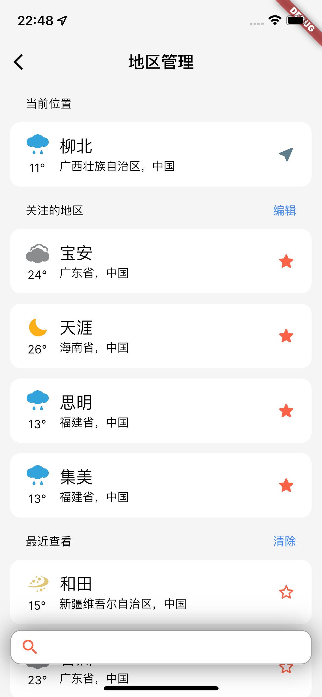 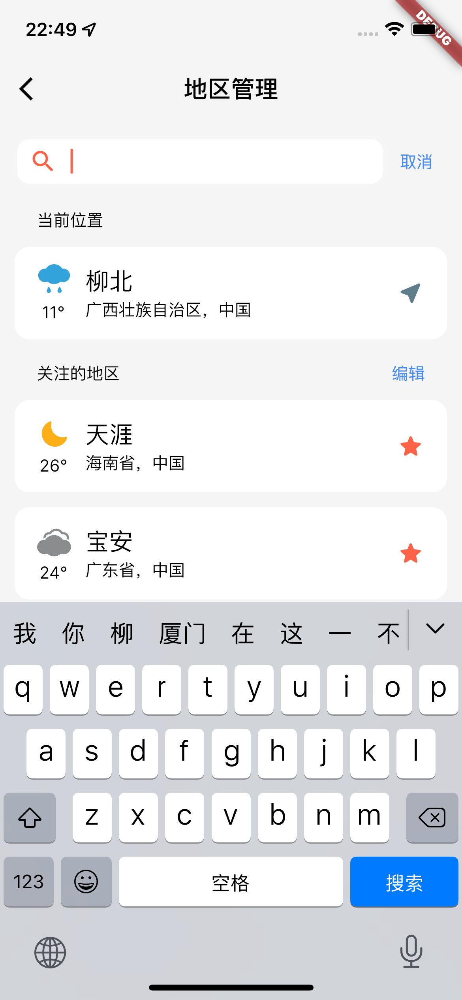 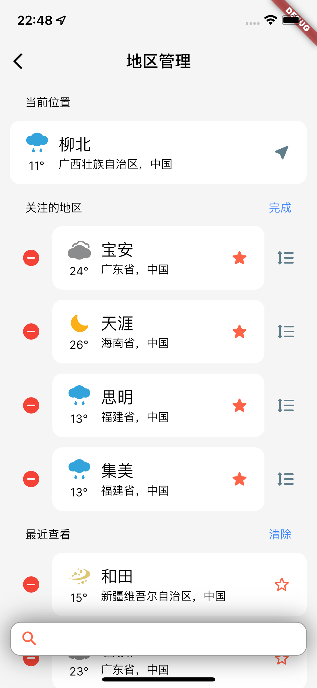
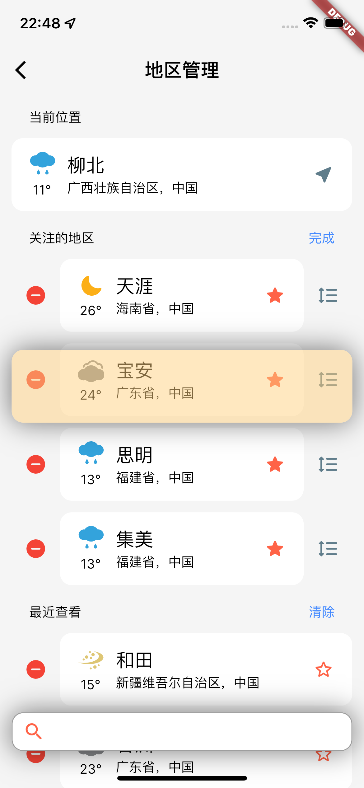 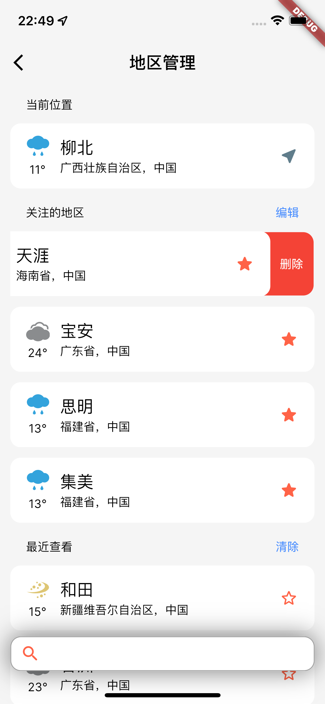

## 界面结构
地区列表分为两层，一层是下方的列表部分，一层是上方的搜索框。同样也是使用使用`Stack+Positioned`实现的，方法与之前的一致，这里不多赘述。

点击编辑文本则列表进入编辑模式，可删除或长按拖动排序。每一个item的实现是借助`Stack+AnimatedPositioned`实现的，这里就使用了隐式动画，只需要告知它结束的位置和时间，它可以在Stack内自行完成动画。

长按排序中需要注意的是，在item的位置发生变化时要及时的对数据源进行刷行，这样才算真正的完成一次排序过程。
# 72小时预报


## 实现
上方的可滑动图标，是使用`RenderBox`实现的，虽然直接使用`CustomPainter`更简单，不过作为一个练手的的项目，更好的选择是多做一些新的尝试。

自定义实现`RenderBox`除了需要进行自绘外，还需要对`child`先后进行测量和布局，最终再确定自身的尺寸信息，在这里的实现中，图表中并没有`child`，所以采用`LeafRenderObjectWidget+RenderBox`的组合就很简单了。
```dart
@override
Size computeDryLayout(BoxConstraints constraints) => constraints.biggest;

@override
bool get sizedByParent => true;

@override
bool hitTestSelf(Offset position) => true;

@override
void paint(PaintingContext context, Offset offset) {
  Canvas canvas = context.canvas;
  // 绘制最左侧的y轴
  canvas.drawLine(
    Offset(_paddingLeft, _latticeHeight) + offset,
    Offset(_paddingLeft, size.height) + offset,
    paintBackground,
  );
  _drawTemperature(canvas, offset);
  _drawWind(canvas, offset);
  _drawPrecip(canvas, offset);
  _drawIndicator(canvas, offset);
}
```
`computeDryLayout`用于确认自身的约束尺寸，这里直接简单的填充满父级传递的约束即可；`sizedByParent`表示自身的尺寸是否只受父级约束的影响，这里因为没有`child`，所以直接返回true，同时也表明自己是一个`relayoutBoundary`；`hitTestSelf`表示自己命中测试是否通过，因为需要滑动有没有`child`，直接返回true；`paint`就是绘制自身的地方，也就是`Canvas`、`Paint`那一套用法。

# 30天预报
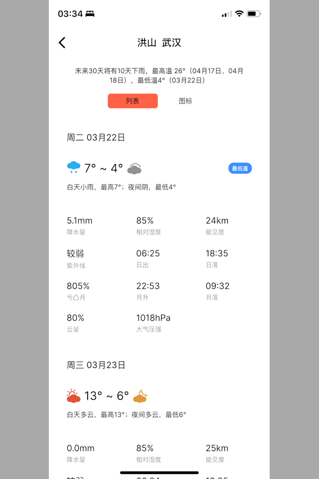

## 界面结构
因为有两种展示数据的方式，所以采用了`IndexedStack`。
```dart
ValueListenableBuilder builder = ValueListenableBuilder<int>(
  valueListenable: _notifier,
  builder: (context, index, child) {
    IndexedStack indexedStack = IndexedStack(
      index: index,
      children: widget.children,
    );
    return indexedStack;
  },
);
```

## 实现
列表的展示方式简单，直接使用`ListView`就行。

图表的展示方式复杂一点，也是使用`RenderBox`实现的，水平列表并不是自绘的，而是事先构建好item，在传入`RenderBox`中进行布局排列的，所以这个`RenderBox`是有`children`的，就需要采用`MultiChildRenderObjectWidget+RenderBox`的组合了。
```dart
/// 绘制水平图表
class DailyDrawing extends MultiChildRenderObjectWidget {
    @override
    RenderObject createRenderObject(BuildContext context) {
      return RenderDailyDrawing(list: list, callback: callback);
    }
}

class DailyDrawingParentData extends ContainerBoxParentData<RenderBox> {}

class RenderDailyDrawing extends RenderBox
    with
        ContainerRenderObjectMixin<RenderBox, DailyDrawingParentData>,
        RenderBoxContainerDefaultsMixin<RenderBox, DailyDrawingParentData> {
          ...
        }
```
采用这个组合后就需要对`children`进行测量排列绘制了。
```dart
@override
void setupParentData(covariant RenderObject child) {
  if (child.parentData is! DailyDrawingParentData) child.parentData = DailyDrawingParentData();
}

@override
void performLayout() {
  RenderBox? child = firstChild;
  double left = 0.px;
  double top = 0.px;
  while (child != null) {
    child.layout(constraints.copyWith(maxWidth: _itemWidth, minWidth: _itemWidth));
    (child.parentData as DailyDrawingParentData).offset = Offset(left, top);
    child = (child.parentData as DailyDrawingParentData).nextSibling;
    left += _itemWidth;
  }
  size = constraints.biggest;
}

@override
void paint(PaintingContext context, Offset offset) {
  Canvas canvas = context.canvas;
  _drawIndicator(canvas, offset, _index);
  _drawTemperature(canvas, offset);
  defaultPaint(context, offset);
}

@override
bool hitTestChildren(BoxHitTestResult result, {required Offset position}) {
  return defaultHitTestChildren(result, position: position);
}
```
`setupParentData`用于修正保存`offset`的类的类型正确；`performLayout`遍历所有`children`，以此对它们进行测量和布局，最后在确定自身的尺寸信息；`paint`根据点击位置的位置和列表滚动的偏移量来确定和绘制指示器的位置，其中还调用了`defaultPaint`的默认绘制方法，这和`hitTestChildren`中调用`defaultHitTestChildren`的默认命中测试方法是一样的，这样归功于混入了`RenderBoxContainerDefaultsMixin`这个mixin类，其中提供了很多`RenderObject`的默认实现。

# 其它一些自定义Widget
|实时天气预报|太阳和月亮的升降|
|:----:|:----:|
|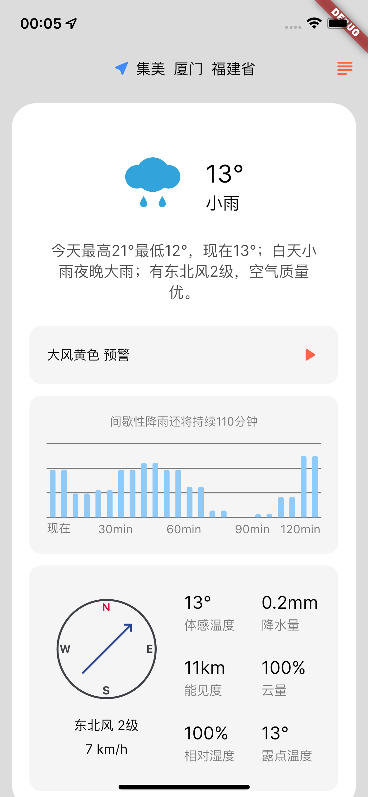|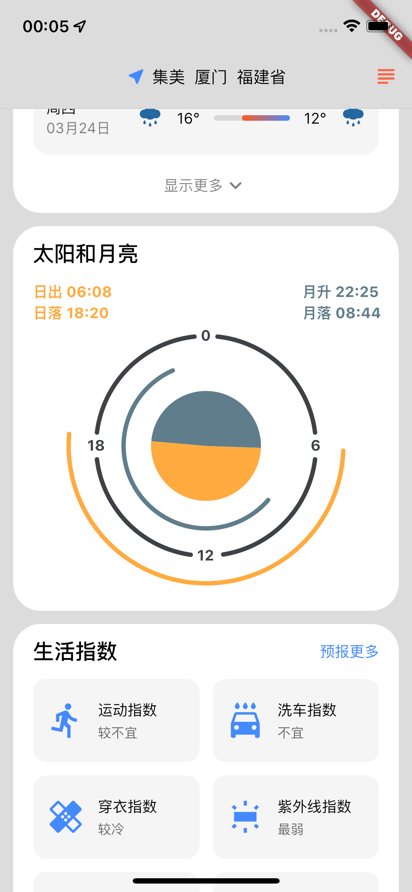|

实时天气预报的卡片中的降水量走势和风向的自定义Widget，和表示太阳和月亮的升降的自定义Widget，都是采用`CustomPainter`实现的，只需要进行一些简单的计算即可。
